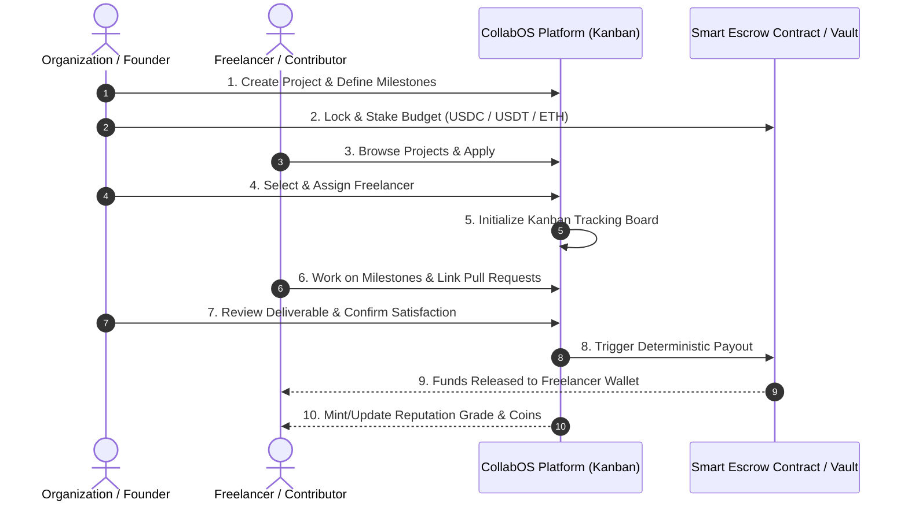

# ⚡ CollabOS

> **The Decentralized Project Tracker & Zero-Trust Freelance Protocol**  
> *Build Projects. Track Milestones. Automate Payments. Trust the Blockchain.*

---

[](https://github.com/)
[](https://react.dev/)
[](https://nodejs.org/)
[](https://www.mongodb.com/)
[](https://ethereum.org/)

---

## 📖 Table of Contents

- [Overview](#-overview)
- [The Problem vs. The CollabOS Solution](#-the-problem-vs-the-collabos-solution)
- [Key Features](#-key-features)
- [How It Works (Workflow Lifecycle)](#-how-it-works-workflow-lifecycle)
- [Technology Stack](#-technology-stack)
- [Project Architecture & Directory Structure](#-project-architecture--directory-structure)
- [Getting Started](#-getting-started)
  - [Prerequisites](#prerequisites)
  - [Backend Setup](#1-backend-setup)
  - [Frontend Setup](#2-frontend-setup)
- [Environment Variables](#-environment-variables)
- [API Endpoints](#-api-endpoints)
- [Project Roadmap](#-project-roadmap)
- [Contributing](#-contributing)
- [License](#-license)

---

## 🌐 Overview

**CollabOS** is a next-generation decentralized project tracking and freelance collaboration platform designed to eliminate counterparty risk. By combining a real-time **Kanban board management system** with **blockchain-powered smart escrows**, CollabOS creates a **zero-trust** environment where:

- **Organizations & Startups** can post projects, link GitHub repositories, and lock milestone bounties directly into non-custodial smart escrow vaults.
- **Freelancers & Contributors** can discover verified tasks, demonstrate on-chain proof of work, earn reputation grades, and receive payment tokens (USDC, USDT, ETH) automatically upon milestone satisfaction.
- **No intermediary fees or arbitrary payment disputes:** Project deliverables are tracked transparently, verified, and settled deterministically.

---

## 💡 The Problem vs. The CollabOS Solution

| Challenge in Traditional Freelancing | How CollabOS Solves It |
| :--- | :--- |
| **Payment Insecurity & Ghosting** | Funds are locked in smart escrows *prior* to work kickoff. Freelancers know the funds are guaranteed. |
| **High Middleman Fees (up to 20%)** | Peer-to-protocol architecture replaces traditional platforms with transparent smart contracts. |
| **Lack of Verifiable Track Record** | Freelancers build an immutable on-chain track record with reputation grades and performance tokens. |
| **Disconnected Project Tracking** | Integrated Kanban board directly connects progress and milestone completion with payment release triggers. |
| **Subjective Dispute Resolution** | Automated verification criteria and protocol-level review ensure fair, rules-based payouts. |

---

## ✨ Key Features

### 🏢 Multi-Organization Project Portal
- Organizations and protocol founders can launch projects specifying milestone deliverables, category (DeFi, NFT, DAO, Infrastructure, etc.), and GitHub repositories.
- Dedicated staking module where organizations deposit milestone budgets into smart escrow vaults (supporting `USDC`, `USDT`, `ETH`).

### 👨‍💻 Freelancer Proof-of-Work & Reputation System
- Contributor profiles with transparent **performance grades** and **reward tokens/coins**.
- Direct pull request (PR) linking to prove milestone delivery.
- Build an immutable resume backed by verified deliverables.

### 📋 Integrated Kanban Board Tracking
- Once a contributor is selected for a project, tracking moves to an interactive **Kanban Board** (`Backlog` ➔ `In Progress` ➔ `Under Review` ➔ `Completed`).
- Keeps organizations and contributors aligned on every phase of project delivery.

### 🔐 Zero-Trust Smart Escrow & Instant Payout
- Milestone budgets are held in multi-sig / smart contract vaults.
- Once the milestone satisfies verification criteria and is approved, payments are immediately and automatically transferred to the contributor's wallet.

### 🔍 Verification & Consensus Module
- Review submissions against defined requirements.
- Audit trails for pull requests, commits, and deliverable approvals.

### 📊 Blockchain Explorer & Protocol Dashboard
- Real-time protocol metrics: active escrows, locked total value (TVL), connected node status, and recent settlements.

---

## 🔄 How It Works (Workflow Lifecycle)



---

## 🛠 Technology Stack

### **Frontend**
- **Framework:** [React 19](https://react.dev/) + [Vite](https://vite.dev/)
- **Routing:** [React Router v7](https://reactrouter.com/)
- **Styling:** Custom Vanilla CSS (Modern Dark UI, Glassmorphism, Micro-animations)
- **Icons & Assets:** Vector Web3 & UI iconography

### **Backend**
- **Runtime:** [Node.js](https://nodejs.org/)
- **Framework:** [Express 5](https://expressjs.com/)
- **Database:** [MongoDB](https://www.mongodb.com/) via [Mongoose 9](https://mongoosejs.com/)
- **Networking:** CORS & RESTful API architecture

### **Web3 & Zero-Trust Layer**
- **Escrow Model:** Deterministic milestone vaults
- **Supported Assets:** `USDC`, `USDT`, `ETH`
- **Wallet Connectivity:** Web3 Provider & Address Sync (`0x...`)

---

## 📂 Project Architecture & Directory Structure

```text
CollabOS/
├── Backend/
│   ├── src/
│   │   ├── db/
│   │   │   └── db.js                 # MongoDB connection handler
│   │   ├── models/
│   │   │   └── project.model.js       # Project schema & mongoose model
│   │   └── App.js                    # Express app configuration & API routes
│   ├── .env                          # Backend environment variables
│   ├── .gitignore
│   ├── package.json
│   └── server.js                     # Backend HTTP server entry point
│
├── Frontend/
│   ├── public/                       # Static public assets
│   ├── src/
│   │   ├── assets/                   # Images, icons, and branding graphics
│   │   ├── components/
│   │   │   ├── Footer.jsx            # Platform footer
│   │   │   ├── Header.jsx            # Landing hero & feature sections
│   │   │   ├── Navbar.jsx            # Global top navigation & wallet sync
│   │   │   ├── ProjectCard.jsx       # Card view for active startup projects
│   │   │   ├── ProjectCard.css       # Project card styles
│   │   │   ├── Sidebar.jsx           # Dashboard navigation sidebar
│   │   │   ├── Sidebar.css           # Sidebar styles
│   │   │   ├── Statecards.jsx        # Protocol metrics cards
│   │   │   └── Statecardx.jsx        # How-it-works process cards
│   │   ├── pages/
│   │   │   ├── BlockChainExplorer.jsx # Explorer for on-chain transactions
│   │   │   ├── Dashboard.jsx         # Contributor & protocol overview
│   │   │   ├── Escrows.jsx           # Locked escrow management & status
│   │   │   ├── ProjectList.jsx       # Public list of active projects
│   │   │   ├── Projects.jsx          # Launch project & smart escrow form
│   │   │   ├── Settings.jsx          # User & protocol settings
│   │   │   └── VerifyWork.jsx        # Milestone verification module
│   │   ├── App.jsx                   # Application router & shared states
│   │   ├── App.css                   # Component-specific styles
│   │   ├── index.css                 # Global theme variables & layout rules
│   │   ├── Layout.jsx                # Sidebar + content dashboard layout
│   │   └── main.jsx                  # React application mount
│   ├── index.html
│   ├── package.json
│   └── vite.config.js
│
└── README.md                         # Project documentation
```

---

## 🚀 Getting Started

Follow these instructions to set up CollabOS locally on your machine.

### Prerequisites

Make sure you have the following installed:
- [Node.js](https://nodejs.org/) (v18 or higher recommended)
- [npm](https://www.npmjs.com/) or [yarn](https://yarnpkg.com/)
- [MongoDB](https://www.mongodb.com/try/download/community) (Local instance or MongoDB Atlas connection string)
- A Web3 Browser Wallet (e.g., [MetaMask](https://metamask.io/))

---

### 1. Backend Setup

1. Open a terminal and navigate to the `Backend` directory:
   ```bash
   cd Backend
   ```

2. Install dependencies:
   ```bash
   npm install
   ```

3. Create a `.env` file in `Backend/` with your configuration:
   ```env
   PORT=3000
   MONGO_URI=mongodb://127.0.0.1:27017/collabos
   ```

4. Start the backend development server:
   ```bash
   node server.js
   ```
   The backend will be running at `http://localhost:3000`.

---

### 2. Frontend Setup

1. Open a second terminal and navigate to the `Frontend` directory:
   ```bash
   cd Frontend
   ```

2. Install dependencies:
   ```bash
   npm install
   ```

3. Start the Vite development server:
   ```bash
   npm run dev
   ```

4. Open your browser and navigate to:
   ```text
   http://localhost:5173
   ```

---

## ⚙️ Environment Variables

### Backend (`Backend/.env`)
| Variable | Description | Example |
| :--- | :--- | :--- |
| `PORT` | Port number for Express API server | `3000` |
| `MONGO_URI` | MongoDB connection URI | `mongodb://127.0.0.1:27017/collabos` |

---

## 📡 API Endpoints

### Project Endpoints (`/projects`)

| Method | Endpoint | Description | Request Body | Response |
| :--- | :--- | :--- | :--- | :--- |
| `POST` | `/projects` | Create and register a new project | `{ ProtocolName, Category, Budget, Currency, Desc, url }` | `201 Created` |
| `GET` | `/projects` | Retrieve all registered projects | *None* | `200 OK` (List of projects) |

---

## 🗺 Project Roadmap

- [x] **Project Scaffolding:** React + Vite frontend & Express + MongoDB backend
- [x] **Core UI & Aesthetics:** Dark mode, glassmorphic styling, and dashboard navigation
- [x] **Project Launch Console:** Form to configure startup protocol, category, currency, budget, and repository
- [x] **Project Exploration:** Project listing and active task exploration cards
- [x] **Database Integration:** Project schema and REST endpoints for creating and fetching projects
- [ ] **Kanban Task Board:** Interactive milestone and task tracking system for assigned contributors
- [ ] **Web3 Wallet Integration:** MetaMask / WalletConnect integration for real wallet authentication
- [ ] **Smart Escrow Contracts:** Solidity escrow contracts for automated locking and releasing of funds
- [ ] **Reputation & Coin Rewards:** On-chain contributor grading and badge/token minting upon verified deliveries
- [ ] **Dispute & Validation Committee:** Decentralized verification voting module

---

## 🤝 Contributing

Contributions, issues, and feature requests are welcome!

1. Fork the Project
2. Create your Feature Branch (`git checkout -b feature/AmazingFeature`)
3. Commit your Changes (`git commit -m "Add some AmazingFeature"`)
4. Push to the Branch (`git push origin feature/AmazingFeature`)
5. Open a Pull Request

---

## 📄 License

This project is licensed under the [ISC License](file:///c:/Users/HP/Desktop/Programs/CollabOS/Backend/package.json).
