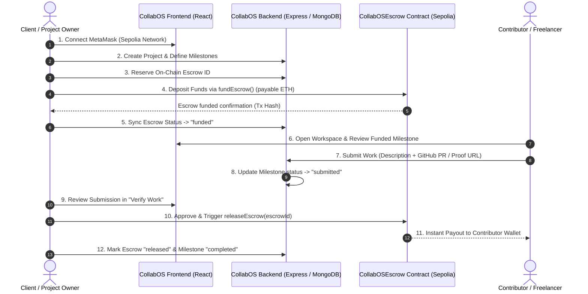

# ⚡ CollabOS

> **The Decentralized Milestone Collaboration & Zero-Trust Smart Escrow Protocol**  
> *Define Deliverables. Stake Escrows. Submit Proof-of-Work. Automate On-Chain Payouts.*

---

[](https://github.com/)
[](https://react.dev/)
[](https://nodejs.org/)
[](https://www.mongodb.com/)
[](https://sepolia.etherscan.io/)
[](https://docs.ethers.org/v6/)

---

## 📖 Table of Contents

- [Overview](#-overview)
- [Core Problem & The CollabOS Solution](#-core-problem--the-collabos-solution)
- [How It Works (End-to-End Lifecycle)](#-how-it-works-end-to-end-lifecycle)
- [System Architecture](#-system-architecture)
- [Key Features & Modules](#-key-features--modules)
- [Smart Contract Escrow (Sepolia)](#-smart-contract-escrow-sepolia)
- [Technology Stack](#-technology-stack)
- [Project Directory Structure](#-project-directory-structure)
- [API Reference](#-api-reference)
- [Database Models (Mongoose)](#-database-models-mongoose)
- [Getting Started](#-getting-started)
  - [Prerequisites](#prerequisites)
  - [1. Backend Setup](#1-backend-setup)
  - [2. Frontend Setup](#2-frontend-setup)
- [Environment Variables](#-environment-variables)
- [Testing & Quality Assurance](#-testing--quality-assurance)
- [Roadmap](#-roadmap)
- [License](#-license)

---

## 🌐 Overview

**CollabOS** is an open-source decentralized freelance and project management platform built to eradicate counterparty risk and payment friction in remote software development.

Traditional freelancing platforms charge extortionate 10–20% middleman fees and leave contributors vulnerable to client ghosting or arbitrary payment refusals. CollabOS replaces the middleman with **deterministic smart escrows on Ethereum Sepolia**:

1. **Clients / Organizations** launch projects, set granular deliverables, and lock milestone payouts directly into non-custodial smart contracts *before* work starts.
2. **Contributors / Developers** build with full certainty of guaranteed funding, submit verifiable proof-of-work (GitHub PRs, commits, and deployment links), and receive instant on-chain payouts immediately upon verification.
3. **Auditability**: Every project state transition, deposit, submission, and payout transaction is tracked in MongoDB and verifiable on Etherscan.

---

## 💡 Core Problem & The CollabOS Solution

| Traditional Freelancing Pitfall | How CollabOS Solves It |
| :--- | :--- |
| **Payment Insecurity & Ghosting** | Funds are locked in a verified smart contract prior to work kick-off. Contributors know payments are guaranteed. |
| **Extortionate Middleman Fees (10–20%)** | Peer-to-contract protocol replaces legacy escrow brokers with direct on-chain settlements. |
| **Ambiguous Scope & Creep** | Work is partitioned into discrete milestones with defined deliverable criteria and fixed bounty amounts. |
| **Subjective Disputes** | Contributors provide cryptographically verifiable proof-of-work (GitHub PRs/URLs) linked to the milestone. |
| **Custodial Risk & Delayed Payouts** | Smart contracts release funds to contributor wallets in seconds without banking delays. |

---

## 🔄 How It Works (End-to-End Lifecycle)



---

## 🏛 System Architecture

```text
┌────────────────────────────────────────────────────────────────────────┐
│                        CLIENT APPLICATION (React 19)                    │
│   Navbar (Wallet Sync) │ Dashboard │ Projects │ Workspace │ Verify Work │
│   Escrows Monitor      │ Submit Work │ Blockchain Explorer             │
└──────────────────┬────────────────────────────────┬────────────────────┘
                   │ REST (HTTP / JSON)              │ Web3 (ethers.js v6)
                   ▼                                 ▼
┌────────────────────────────────────────┐  ┌────────────────────────────┐
│         BACKEND API (Express 5)        │  │  ETHEREUM SEPOLIA TESTNET  │
│  - Project & Milestone Controllers     │  │  - CollabOSEscrow Contract │
│  - Escrow & Submission Controllers     │  │    (0x645aB33...2fCFA8)    │
│  - Blockchain RPC Syncer (Alchemy)     │  │  - fundEscrow(escrowId)    │
│  - Express Request Validation          │  │  - releaseEscrow(escrowId) │
└──────────────────┬─────────────────────┘  │  - getEscrow(escrowId)     │
                   │ Mongoose ODM           └──────────────▲─────────────┘
                   ▼                                       │
┌────────────────────────────────────────┐                 │ JSON-RPC
│         DATABASE (MongoDB Atlas)       │                 │
│  - Users                               │                 │
│  - Projects                            │                 │
│  - Milestones                          │                 │
│  - Escrows (with Tx Hashes)            ├─────────────────┘
│  - Submissions (with Proof URLs)       │ (Alchemy Provider verification)
└────────────────────────────────────────┘
```

---

## ✨ Key Features & Modules

### 1. 💼 Project & Workspace Hub
- **Project Management**: Create projects with names, descriptions, and budgets.
- **Milestone Decomposition**: Break projects into standalone milestone deliverables with individual ETH allocations.
- **Status Pipeline**: Automatically tracks milestone states: `pending` ➔ `funded` ➔ `submitted` ➔ `approved` / `completed`.

### 2. 🔐 Smart Escrow Management (`/escrows`)
- **Deterministic Escrow Reservation**: Generates sequential on-chain escrow IDs mapped to milestone database IDs.
- **One-Click MetaMask Funding**: Directly calls the smart contract payable `fundEscrow(escrowId)` function with Sepolia ETH.
- **On-Chain Audit Trails**: Stores `fundingTxHash` and `releaseTxHash` for instant verification on block explorers.
- **Sync with Blockchain**: Backend RPC query syncs local database state with the real on-chain contract state.

### 3. 📤 Contributor Submission Portal (`/submit-work`)
- **Direct Link or Catalog Mode**: Submit work directly from a milestone link or browse active projects.
- **Proof-of-Work Verification**: Attach GitHub PR URLs, commit hashes, or live deployment URLs along with descriptive notes.
- **Safe Guardrails**: Submissions are only permitted for milestones with verified, funded escrows.

### 4. ✅ Client Work Verification (`/verify-work`)
- **Single-Screen Review**: Review all pending milestone submissions across projects.
- **Direct Proof Inspection**: Jump directly to submitted GitHub PRs.
- **On-Chain Settlement Trigger**: Releasing a submission triggers `releaseEscrow` via MetaMask, immediately paying the contributor and updating MongoDB atomically.

### 5. 🔍 Blockchain Explorer (`/blockchain`)
- Inspect the deployed escrow contract address and real-time testnet ETH balance.
- Check Alchemy RPC node status and live network connectivity.
- Verify individual on-chain escrow records (`client`, `contributor`, `amount`, `funded`, `released`).

---

## ⛓ Smart Contract Escrow (Sepolia)

The protocol interacts with the verified `CollabOSEscrow` contract deployed on Ethereum Sepolia:

- **Contract Address:** [`0x645aB33263798dd2a0B11d399ad6dc2228f2CfA8`](https://sepolia.etherscan.io/address/0x645aB33263798dd2a0B11d399ad6dc2228f2CfA8)
- **Network:** Ethereum Sepolia (Chain ID: `11155111` / `0xaa36a7`)

### Contract ABI Interface

```solidity
// Core Escrow Operations
function createEscrow(uint256 escrowId, address contributor) external;
function fundEscrow(uint256 escrowId) external payable;
function releaseEscrow(uint256 escrowId) external;

// State Query
function getEscrow(uint256 escrowId) external view returns (
    address client,
    address contributor,
    uint256 amount,
    bool funded,
    bool released
);
```

---

## 🛠 Technology Stack

### Frontend
- **Framework:** [React 19](https://react.dev/)
- **Bundler:** [Vite 8](https://vite.dev/)
- **Routing:** [React Router v7](https://reactrouter.com/)
- **Web3 Integration:** [Ethers.js v6](https://docs.ethers.org/v6/)
- **Icons:** [Lucide React](https://lucide.dev/)
- **Styling:** Custom Vanilla CSS + [Tailwind CSS v4](https://tailwindcss.com/)
- **Aesthetics:** Sleek dark mode, glassmorphism, responsive cards, micro-animations.

### Backend
- **Runtime:** [Node.js](https://nodejs.org/) (ES Modules)
- **Framework:** [Express 5](https://expressjs.com/)
- **Database:** [MongoDB Atlas](https://www.mongodb.com/) via [Mongoose 9](https://mongoosejs.com/)
- **Validation:** [express-validator](https://express-validator.github.io/)
- **Web3 Provider:** Ethers.js JSON-RPC Provider via Alchemy Sepolia
- **Cross-Origin Security:** CORS enabled

---

## 📂 Project Directory Structure

```text
CollabOS/
├── Backend/
│   ├── src/
│   │   ├── blockchain/
│   │   │   └── CollabOSEscrow.json    # Compiled smart contract ABI artifact
│   │   ├── config/
│   │   │   ├── blockchain.js          # Alchemy RPC provider & contract address
│   │   │   └── db.js                  # Mongoose MongoDB connection handler
│   │   ├── controllers/
│   │   │   ├── escrowController.js    # Escrow reservation, funding & blockchain sync
│   │   │   ├── milestoneController.js # Milestone creation, listing & status updates
│   │   │   ├── projectController.js   # Project CRUD & contributor assignments
│   │   │   ├── submissionController.js# Proof-of-work submission & review
│   │   │   └── userController.js      # User creation & wallet lookup
│   │   ├── middleware/
│   │   │   ├── validateProject.js     # Project input schema validation
│   │   │   └── validateRequest.js     # express-validator result handler
│   │   ├── models/
│   │   │   ├── Escrow.js              # Escrow schema (on-chain IDs, statuses, hashes)
│   │   │   ├── Milestone.js           # Milestone schema (amounts, deliverables)
│   │   │   ├── Project.js             # Project schema (budgets, contributors)
│   │   │   ├── Submission.js          # Work submission schema (proof URLs)
│   │   │   └── User.js                # User schema (wallet addresses, roles)
│   │   ├── routes/
│   │   │   ├── escrowRoutes.js        # /escrows endpoints + on-chain verification
│   │   │   ├── milestoneRoutes.js     # /projects/:projectId/milestones sub-routes
│   │   │   ├── projectRoutes.js       # /projects endpoints
│   │   │   ├── submissionRoutes.js    # /submissions & nested submission endpoints
│   │   │   └── userRoutes.js          # /users endpoints
│   │   ├── services/
│   │   │   └── blockchainService.js   # On-chain contract query wrappers
│   │   └── server.js                  # Express application root & route mounting
│   ├── .env                           # Backend environment variables
│   ├── .gitignore
│   └── package.json
│
├── frontend/
│   ├── public/
│   ├── src/
│   │   ├── assets/
│   │   ├── components/
│   │   │   ├── blockchain/
│   │   │   │   └── WalletButton.jsx   # Wallet connect / status button
│   │   │   ├── layout/
│   │   │   │   ├── AppLayout.jsx      # Top navbar + sidebar shell
│   │   │   │   ├── Navbar.jsx         # Network indicator & wallet button
│   │   │   │   └── Sidebar.jsx        # Navigation links & active state
│   │   │   ├── project/
│   │   │   │   ├── ProjectCard.jsx    # Project overview card
│   │   │   │   └── ProjectList.jsx    # Project list view
│   │   │   └── ui/
│   │   │       ├── Badge.jsx          # Status pill badge component
│   │   │       └── Button.jsx         # Accessible button component
│   │   ├── hooks/
│   │   │   └── useWallet.js           # MetaMask connection & Sepolia chain hook
│   │   ├── lib/
│   │   │   ├── api.js                 # Frontend REST API client
│   │   │   └── escrow.js              # ethers.js smart contract interactions
│   │   ├── pages/
│   │   │   ├── BlockchainExplorer.jsx # On-chain contract & RPC inspector
│   │   │   ├── Dashboard.jsx          # Protocol metrics, stats & project workflow
│   │   │   ├── Escrows.jsx            # All escrows monitor & on-chain statuses
│   │   │   ├── Projects.jsx           # All projects directory & filter
│   │   │   ├── Settings.jsx           # User & network settings
│   │   │   ├── SubmitWork.jsx         # Contributor deliverable submission form
│   │   │   ├── VerifyWork.jsx         # Client review & on-chain fund release
│   │   │   └── Workspace.jsx          # Project workspace & milestone management
│   │   ├── App.jsx                    # Route mapping & layout wrapper
│   │   ├── App.css
│   │   ├── index.css                  # Design tokens, variables & typography
│   │   └── main.jsx                   # React DOM root entry point
│   ├── index.html
│   ├── package.json
│   └── vite.config.js
│
└── README.md
```

---

## 📡 API Reference

### 1. Projects (`/projects`)

| Method | Endpoint | Description | Payload |
| :--- | :--- | :--- | :--- |
| `POST` | `/projects` | Create a new project | `{ name, description, budget, owner }` |
| `GET` | `/projects` | Retrieve all registered projects | *None* |
| `GET` | `/projects/:id` | Get project details (populated owner & contributors) | *None* |
| `PATCH` | `/projects/:id` | Update project metadata | `{ name?, description?, budget?, status? }` |
| `PATCH` | `/projects/:id/contributors` | Add contributor to project | `{ contributorId }` |

### 2. Milestones (`/projects/:projectId/milestones`)

| Method | Endpoint | Description | Payload |
| :--- | :--- | :--- | :--- |
| `GET` | `/projects/:projectId/milestones` | Get all milestones for a project | *None* |
| `POST` | `/projects/:projectId/milestones` | Create a new milestone under a project | `{ title, description, amount }` |

### 3. Submissions (`/submissions` or `/projects/:projectId/milestones/:milestoneId/submissions`)

| Method | Endpoint | Description | Payload |
| :--- | :--- | :--- | :--- |
| `GET` | `/submissions` | Retrieve all submissions (or filter by `?milestoneId=`) | *None* |
| `POST` | `/submissions` | Submit milestone deliverable & proof-of-work | `{ milestone, contributor, description, proofUrl }` |
| `PATCH` | `/submissions/:submissionId` | Approve or reject a submission | `{ status: "approved" \| "rejected" }` |

### 4. Escrows (`/escrows`)

| Method | Endpoint | Description | Payload |
| :--- | :--- | :--- | :--- |
| `GET` | `/escrows` | List all escrow records | *None* |
| `POST` | `/escrows` | Create an escrow record | `{ project, milestone, client, contributor, amount, token, chain, contractAddress, onChainEscrowId }` |
| `POST` | `/escrows/reserve` | Reserve an on-chain escrow ID for funding | `{ project, milestone, client, contributor, amount, token, chain, contractAddress }` |
| `GET` | `/escrows/:id` | Retrieve escrow record by database ID | *None* |
| `PATCH` | `/escrows/:id` | Update escrow status / transaction hashes | `{ status, fundingTxHash?, releaseTxHash? }` |
| `PATCH` | `/escrows/:id/sync` | Sync escrow state from blockchain | *None* |
| `GET` | `/escrows/:id/on-chain` | Direct RPC query of on-chain escrow details | *None* |
| `GET` | `/escrows/:id/verify-on-chain` | Verify funding on-chain | *None* |
| `GET` | `/escrows/contract/balance` | Query smart contract balance (ETH & Wei) | *None* |

---

## 🗄 Database Models (Mongoose)

### `Project`
```javascript
{
  name: String,            // required
  description: String,     // required
  budget: Number,          // required, min 0
  status: String,          // ["draft", "active", "completed", "cancelled"], default: "draft"
  owner: ObjectId,         // ref: "User", required
  contributors: [ObjectId] // ref: "User"
}
```

### `Milestone`
```javascript
{
  project: ObjectId,         // ref: "Project", required
  title: String,             // required
  description: String,       // required
  amount: Number,            // required, min 0
  status: String,            // ["pending", "completed"], default: "pending"
  submissionStatus: String   // ["not_submitted", "submitted", "approved", "rejected"], default: "not_submitted"
}
```

### `Escrow`
```javascript
{
  project: ObjectId,         // ref: "Project", required
  milestone: ObjectId,       // ref: "Milestone", required
  client: ObjectId,          // ref: "User", required
  contributor: ObjectId,     // ref: "User", required
  amount: Number,            // required
  token: String,             // default: "ETH"
  chain: String,             // default: "sepolia"
  contractAddress: String,   // required
  onChainEscrowId: Number,   // required, indexed
  status: String,            // ["created", "funded", "released", "refunded"], default: "created"
  fundingTxHash: String,
  releaseTxHash: String
}
```

### `Submission`
```javascript
{
  milestone: ObjectId,       // ref: "Milestone", required
  contributor: ObjectId,     // ref: "User", required
  description: String,       // required
  proofUrl: String,          // optional (GitHub PR / commit URL)
  status: String             // ["pending", "approved", "rejected"], default: "pending"
}
```

---

## 🚀 Getting Started

### Prerequisites

Ensure you have the following installed on your machine:
- **Node.js** (v18.x or v20.x+)
- **npm** (v9.x+)
- **MetaMask Browser Extension** (configured with the **Ethereum Sepolia Testnet**)
- Sepolia Testnet ETH (obtainable from free faucets like [Google Cloud Sepolia Faucet](https://cloud.google.com/application/infrastructure/faucets/ethereum/sepolia) or [Alchemy Faucet](https://www.alchemy.com/faucets/ethereum-sepolia))

---

### 1. Backend Setup

1. Open a terminal and navigate to the `Backend` directory:
   ```bash
   cd Backend
   ```

2. Install dependencies:
   ```bash
   npm install
   ```

3. Configure your `.env` file in `Backend/.env`:
   ```env
   PORT=5000
   MONGO_URI=mongodb+srv://<user>:<password>@cluster0.femuniq.mongodb.net/?appName=Cluster0
   SEPOLIA_RPC_URL=https://eth-sepolia.g.alchemy.com/v2/your_alchemy_api_key
   ```

4. Start the backend with watch mode:
   ```bash
   npm start
   ```
   *The backend will be running at `http://localhost:5000`.*

---

### 2. Frontend Setup

1. Open a separate terminal and navigate to the `frontend` directory:
   ```bash
   cd frontend
   ```

2. Install dependencies:
   ```bash
   npm install
   ```

3. Start the Vite development server:
   ```bash
   npm run dev
   ```

4. Open your browser and navigate to:
   ```text
   http://localhost:5173
   ```

5. Connect MetaMask, switch to **Sepolia**, and you are ready to create projects and fund escrows!

---

## ⚙️ Environment Variables

### Backend Configuration (`Backend/.env`)

| Variable | Description | Example |
| :--- | :--- | :--- |
| `PORT` | Local port for Express API server | `5000` |
| `MONGO_URI` | MongoDB connection string (Atlas or Local) | `mongodb+srv://...` |
| `SEPOLIA_RPC_URL` | Ethereum Sepolia JSON-RPC URL (Alchemy/Infura) | `https://eth-sepolia.g.alchemy.com/v2/...` |

---

## 🧪 Testing & Quality Assurance

### Build Verification
To verify frontend compilation and asset bundling:
```bash
cd frontend
npm run build
```

### Health Check
Verify the backend is live:
```bash
curl http://localhost:5000/
# Response: {"message":"Server is running"}
```

Query the smart contract balance via the backend RPC service:
```bash
curl http://localhost:5000/escrows/contract/balance
# Response: {"balanceWei":"...","balanceEth":"..."}
```

---

## 🗺 Roadmap

- [x] **Project Scaffolding:** React 19 + Vite 8 frontend and Express 5 + MongoDB backend.
- [x] **Sepolia Smart Escrow:** Deployed `CollabOSEscrow` contract (`0x645aB33...2fCFA8`).
- [x] **MetaMask Web3 Integration:** `ethers.js v6` browser provider, network switching (`0xaa36a7`), and account listeners.
- [x] **Workspace Milestone Pipeline:** Granular milestone creation, escrow reservation, funding, and release triggers.
- [x] **Proof-of-Work Verification Module:** Submissions dashboard with GitHub PR links and on-chain release integration.
- [x] **Blockchain Explorer:** Live on-chain contract inspection and RPC sync.
- [ ] **Arbitration & Dispute Resolution Module:** Multi-sig council for handling contested milestones.
- [ ] **ERC-20 Token Escrows:** Support for `USDC` and `USDT` deposits alongside native ETH.
- [ ] **On-Chain Reputation Passports:** Soulbound NFT badges certifying completed project tiers.

---

## 🤝 Contributing

Contributions are warmly welcome! To contribute:

1. Fork the repository.
2. Create your feature branch:
   ```bash
   git checkout -b feature/AmazingFeature
   ```
3. Commit your changes:
   ```bash
   git commit -m "feat: Add AmazingFeature"
   ```
4. Push to the branch:
   ```bash
   git push origin feature/AmazingFeature
   ```
5. Open a Pull Request.

---

## 📄 License

This project is licensed under the [ISC License](file:///c:/Users/HP/Desktop/Programs/CollabOS/Backend/package.json).
